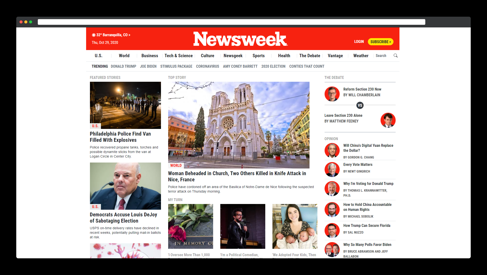
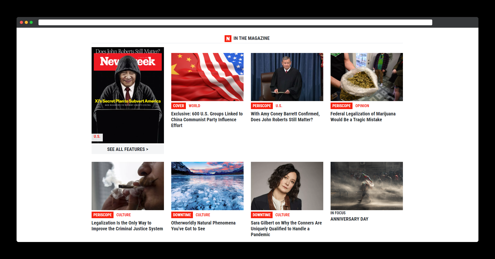

# Responsive Design and CSS Frameworks

> This is a clone of www.newsweek.com website.

We use Bootstrap CSS classes everytime we could, to clone the website.

## Built With

- HTML
- CSS
- Git
- Bootstrap

## Live Demo

[Live Demo Link](https://carloso0114.github.io/Project-Using-Bootstrap/)

## Authors

👨‍💻 **Breno Xavier**

- GitHub: [@brenoxav](https://github.com/brenoxav)
- LinkedIn: [Breno Xavier](https://linkedin.com/in/brenoxav)

👨‍💻 **Carlos Ospina**

- GitHub: [@carloso0114](https://github.com/carloso0114)
- Twitter: [Carlos_Osp1](https://twitter.com/Carlos_Osp1)
- LinkedIn: [Carlos Ospina](https://www.linkedin.com/in/carlos-ospina-242b831a6/)

## Show your support

Give a ⭐️ if you like this project!
